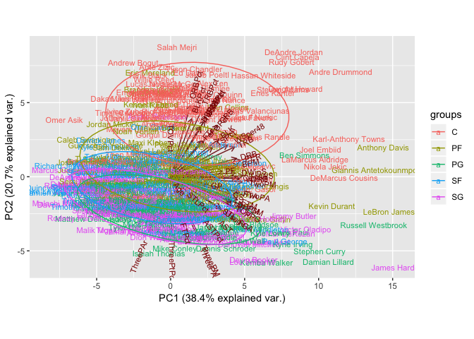

Post 1 - Multivariate Data Mining - Predicting NBA player salary through PCA
================
Lewis Pipkin
December 7, 2018

In this blog post, I'm going to compare three common model-building techniques to show how predictions can be improved by applying different techniques. The dataset I am using [(which is available on my Github),](https://github.com/lewispipkin/NBA/blob/master/data/NBAfull2018.csv) is a set of NBA data pulled from a website called basketball-reference.com, which is a comprehensive basketball statistics database that is a part of a network of sports databases, including baseball, American football, and hockey. I joined together the per-game statistics, advanced statistics, and position/salary information for all active players in the NBA during the 2017-2018 season. There are some players who played a negligible number of minutes removed dating back to this dataset's use in a previous analysis so as not to completely skew the predictions. (Here's looking at you, Joakim Noah-- welcome back to the league.)

Players who received multiple contracts during the 17-18 season due to their initial contract being waived, bought out, or amnestied have their salary listed as the sum of each contract's total annual value. For example, Marco Belinelli earned $6,306,061 in annual salary last year from the Atlanta Hawks in the final season of the 3-year deal he initially signed with the Sacramento Kings. Once the Hawks bought out the final bit of the contract, Belinelli signed a contract worth $776,217 with the Philadelphia 76ers [(these figures come from here, with some rounding done).](https://www.spotrac.com/nba/san-antonio-spurs/marco-belinelli-2314/cash-earnings/)

``` r
NBA <- read.csv("NBAfull2018.csv",stringsAsFactors = F)[,-1]
NBA$Salary[NBA$Player=="Marco Belinelli"]
```

    ## [1] 7082277

The first technique I will show is a plain multiple linear regression with 3 predictors, the 3 main counting statistics for basketball: points, rebounds, and assists.

``` r
rownames(NBA) <- NBA$Player
NBA <- NBA[,-1]

set.seed(12)
train_ind <- sample(1:nrow(NBA),.7*nrow(NBA),F)
NBA_train <- NBA[train_ind,]
NBA_test <- NBA[-train_ind,]

lm <- lm(Salary~PPG + TRB + AST ,data=NBA_train)
summary(lm)
```

    ## 
    ## Call:
    ## lm(formula = Salary ~ PPG + TRB + AST, data = NBA_train)
    ## 
    ## Residuals:
    ##       Min        1Q    Median        3Q       Max 
    ## -15484243  -3593548   -670201   3641514  19157803 
    ## 
    ## Coefficients:
    ##             Estimate Std. Error t value Pr(>|t|)    
    ## (Intercept) -1715714     734481  -2.336 0.020187 *  
    ## PPG           489715      93676   5.228 3.32e-07 ***
    ## TRB           647223     175098   3.696 0.000262 ***
    ## AST           938917     268340   3.499 0.000542 ***
    ## ---
    ## Signif. codes:  0 '***' 0.001 '**' 0.01 '*' 0.05 '.' 0.1 ' ' 1
    ## 
    ## Residual standard error: 5791000 on 285 degrees of freedom
    ## Multiple R-squared:  0.4396, Adjusted R-squared:  0.4337 
    ## F-statistic: 74.51 on 3 and 285 DF,  p-value: < 2.2e-16

This model is overall significant and gives us an adjusted R-sq. of around 43%.

``` r
NBA_test$pred.salary <- predict(lm,NBA_test)

rmse <- function(a,b){
paste0("RMSE: ", round(sqrt(mean((a-b)^2)),4))
 }
rmse(NBA_test$Salary,NBA_test$pred.salary)
```

    ## [1] "RMSE: 6062034.6626"

I'm going to use RMSE as the method of comparison between all the methods used in this post. So, we get an RMSE of around $6 million for the linear model's performance on the training set. What we see here is that each additional point or rebound has less of an association with higher salary than does each additional assist. This makes sense, obviously scoring is an important facet of the game, but the very best players also find ways to help their teammates score more points.

Let's move on to a slightly more advanced method, random forest. This allows us to incorporate the nonlinear relationships between variables better than just a multiple linear regression.

``` r
rm(list=ls())
NBA <- read.csv("NBAfull2018.csv",stringsAsFactors = F)[,-1]
rownames(NBA) <- NBA$Player
NBA <- NBA[,-1]

set.seed(50)
train_ind <- sample(1:nrow(NBA),.7*nrow(NBA),F)
NBA_train <- NBA[train_ind,]
NBA_test <- NBA[-train_ind,]

rf <- randomForest(x=NBA_train[,1:17],y=NBA_train[,48])
varImpPlot(rf)
```


More on what's going on in this plot a bit later. I have some thoughts.

``` r
NBA_test$pred.salary <- predict(rf,NBA_test)

rmse <- function(a,b){
paste0("RMSE: ", round(sqrt(mean((a-b)^2)),4))
 }
rmse(NBA_test$Salary,NBA_test$pred.salary)
```

    ## [1] "RMSE: 6449665.752"

So we see that this method gives us a worse RMSE by around $400k. That's not always the case, of course, but with this data (or possibly this particular seed), it didn't pan out quite as well as we'd hoped. So, we'll move on to our third method of the day, principal components analysis.

``` r
rm(list=ls())
NBA <- read.csv("NBAfull2018.csv",stringsAsFactors = F)[,-1]
NBA.q <- NBA[,-c(1,25,49)]
set.seed(11);s <- sample(1:ncol(NBA.q),10,F)
M <- cor(NBA.q[,c(s)])
corrplot(M, method = "circle")
```


We see here that many statistics are fairly highly correlated with each other. Hence, using PCA is a good method: PCA is a procedure that converts a set of correlated variables into a set of values of linearly uncorrelated variables.

``` r
NBA.q <- data.frame(apply(NBA.q, 2, scale))
rownames(NBA.q) <- NBA$Player
NBA.q$Position <- NBA$Position
NBA <- NBA.q
NBA.pca <- prcomp(NBA[,1:46], center = TRUE,scale. = TRUE)

ggbiplot(NBA.pca,ellipse=TRUE, obs.scale = 1, var.scale = 1,var.axes=T,labels=rownames(NBA), groups=NBA$Position)
```



**Sidebar** to add in this visualization I made while getting a better understanding of what I was doing. While this graph is incredibly noisy, I wanted to include it because (1) it's pretty cool and (2) it provides some nice foreshadowing for a potential future blog post: we see some pretty clearly defined clusters forming on the outskirts of the mass of names that roughly include injured guards, combo guards on tanking teams, superstar point guards, star small forwards, rim-running big men, and the unicorns (shot-blockers who can also shoot 3-pointers). I digress. Let's continue with the PCA below:

``` r
pc <- data.frame(NBA.pca$x)
salaries <- read.csv("NBAfull2018.csv",stringsAsFactors = F)[,50]
pc$salary <- salaries
set.seed(33)
train_ind <- sample(1:nrow(pc),.7*nrow(pc),F)
NBA_train <- pc[train_ind,]
NBA_test <- pc[-train_ind,]


model1 <- lm(NBA_train$salary ~ NBA_train[,1] + NBA_train[,2] + NBA_train[,3] + NBA_train[,4] + NBA_train[,5] + NBA_train[,6])
summary(model1) 
```

    ## 
    ## Call:
    ## lm(formula = NBA_train$salary ~ NBA_train[, 1] + NBA_train[, 
    ##     2] + NBA_train[, 3] + NBA_train[, 4] + NBA_train[, 5] + NBA_train[, 
    ##     6])
    ## 
    ## Residuals:
    ##       Min        1Q    Median        3Q       Max 
    ## -16509245  -3745086  -1024346   3329050  20859700 
    ## 
    ## Coefficients:
    ##                Estimate Std. Error t value Pr(>|t|)    
    ## (Intercept)     7291898     345907  21.081   <2e-16 ***
    ## NBA_train[, 1]  1054730      81901  12.878   <2e-16 ***
    ## NBA_train[, 2]  -260375     107313  -2.426   0.0159 *  
    ## NBA_train[, 3]   187741     174324   1.077   0.2824    
    ## NBA_train[, 4]   194715     225592   0.863   0.3888    
    ## NBA_train[, 5]   140087     224225   0.625   0.5326    
    ## NBA_train[, 6]  -135385     304006  -0.445   0.6564    
    ## ---
    ## Signif. codes:  0 '***' 0.001 '**' 0.01 '*' 0.05 '.' 0.1 ' ' 1
    ## 
    ## Residual standard error: 5873000 on 282 degrees of freedom
    ## Multiple R-squared:  0.3822, Adjusted R-squared:  0.369 
    ## F-statistic: 29.07 on 6 and 282 DF,  p-value: < 2.2e-16

``` r
#3rd-6th pc are insignificant, remove
model2 <- lm(NBA_train$salary ~ NBA_train[,1] + NBA_train[,2])
summary(model2)
```

    ## 
    ## Call:
    ## lm(formula = NBA_train$salary ~ NBA_train[, 1] + NBA_train[, 
    ##     2])
    ## 
    ## Residuals:
    ##       Min        1Q    Median        3Q       Max 
    ## -16625763  -3749189   -964053   3329202  20888534 
    ## 
    ## Coefficients:
    ##                Estimate Std. Error t value Pr(>|t|)    
    ## (Intercept)     7298289     344665  21.175   <2e-16 ***
    ## NBA_train[, 1]  1051465      81651  12.878   <2e-16 ***
    ## NBA_train[, 2]  -270930     106697  -2.539   0.0116 *  
    ## ---
    ## Signif. codes:  0 '***' 0.001 '**' 0.01 '*' 0.05 '.' 0.1 ' ' 1
    ## 
    ## Residual standard error: 5858000 on 286 degrees of freedom
    ## Multiple R-squared:  0.3765, Adjusted R-squared:  0.3721 
    ## F-statistic: 86.34 on 2 and 286 DF,  p-value: < 2.2e-16

``` r
anova(model1,model2) 
```

    ## Analysis of Variance Table
    ## 
    ## Model 1: NBA_train$salary ~ NBA_train[, 1] + NBA_train[, 2] + NBA_train[, 
    ##     3] + NBA_train[, 4] + NBA_train[, 5] + NBA_train[, 6]
    ## Model 2: NBA_train$salary ~ NBA_train[, 1] + NBA_train[, 2]
    ##   Res.Df        RSS Df   Sum of Sq      F Pr(>F)
    ## 1    282 9.7254e+15                             
    ## 2    286 9.8154e+15 -4 -8.9957e+13 0.6521 0.6258

``` r
#no significant difference

NBA_test$pred.salary <- coef(model2)[[1]] + coef(model2)[[2]] * NBA_test[,1] + coef(model2)[[3]] * NBA_test[,2]

rmse <- function(a,b){
paste0("RMSE: ", round(sqrt(mean((a-b)^2)),4))
 }
rmse(NBA_test$salary,NBA_test$pred.salary)
```

    ## [1] "RMSE: 5876994.4044"

So, using the first and second principal components turns out to do enough explanation to give us a lower RMSE than the previous two methods we used (10% lower than the random forest). This shows us that using slightly more advanced techniques, while muddying the waters of interpretation/explanation to non-technical peers a little bit, can improve your predictions by a significant amount. In the future, though, there are certainly some things that can be changed about each of the three methods used in this write-up.

As an example, the variable importance plot of the random forest model used above paints a picture that helps to explain the high RMSE: given that many of the inputs to that model are volume statistics (counting stats accumulated over the course of the year vs. rate statistics, many of which are also incorporated), the predictions are going to be off by a lot given that many highly-paid players missed a significant amount of games last year. Boston's Gordon Hayward wasn't included in this dataset due to having only played 6 minutes on the year, but Memphis' Mike Conley, by no fault of his own due to only playing 12 games due to injuries, didn't earn his $28.5m. Using rate statistics, such as stats per 48 minutes or (my personal favorite) per 100 possessions, will surely yield better results. However, due to the aforementioned high correlation between many performance measures, PCA remains a demonstrably better method for tackling this specific topic.
