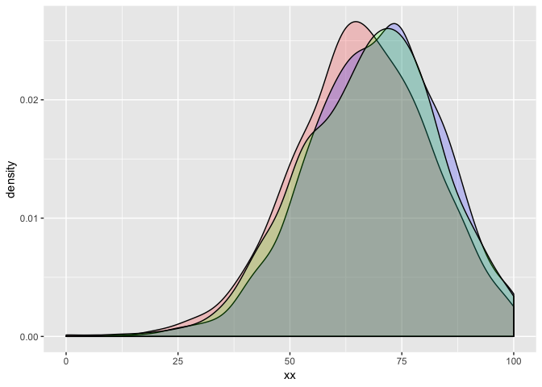
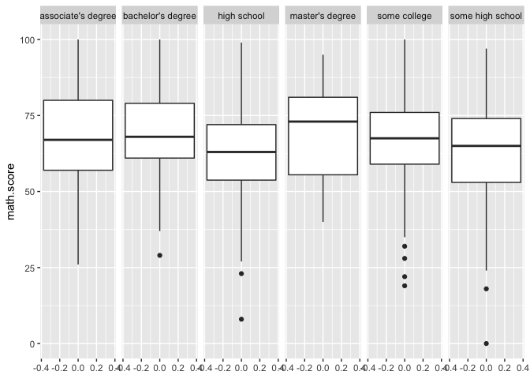
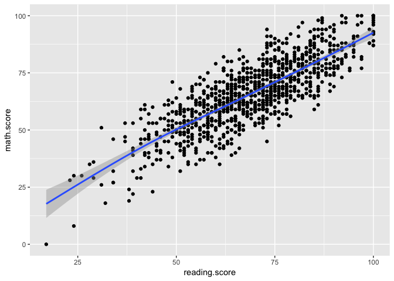
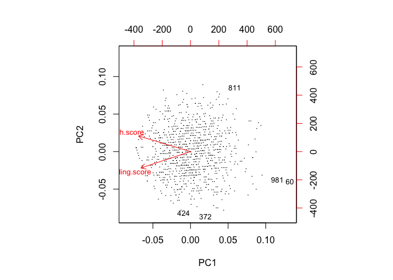

Post 3 - Multivariate Data Mining - Outlier Detection and Data Visualization
================
Lewis Pipkin
December 11, 2018

I am going to discuss some outlier detection methods and, in that process, use some different data visualization techniques. I have downloaded a [dataset from Kaggle](https://www.kaggle.com/spscientist/students-performance-in-exams) that tells us some information about students, as well as their test scores in school along with some basic socioeconomic indicators.

``` r
data <- read.csv("~/Downloads/StudentsPerformance.csv",stringsAsFactors = F)
glimpse(data)
```

    ## Observations: 1,000
    ## Variables: 8
    ## $ gender                      <chr> "female", "female", "female", "mal...
    ## $ race.ethnicity              <chr> "group B", "group C", "group B", "...
    ## $ parental.level.of.education <chr> "bachelor's degree", "some college...
    ## $ lunch                       <chr> "standard", "standard", "standard"...
    ## $ test.preparation.course     <chr> "none", "completed", "none", "none...
    ## $ math.score                  <int> 72, 69, 90, 47, 76, 71, 88, 40, 64...
    ## $ reading.score               <int> 72, 90, 95, 57, 78, 83, 95, 43, 64...
    ## $ writing.score               <int> 74, 88, 93, 44, 75, 78, 92, 39, 67...

The *glimpse* function shows us the data, similar to using *str*. So we can see that we have gender, anonymized race groups, parents' education, lunch plan status, and whether they completed a test prep course before this test. In addition, we have their test scores in three areas: math, reading, and writing. Before conducting any analysis, we will inspect the data:

``` r
dat <- data.frame(xx=c(data$math.score,data$reading.score,data$writing.score),yy=c(rep("math",1000),rep("reading",1000),rep("writing",1000)))
ggplot(dat,aes(x=xx)) +
    geom_density(dat=subset(dat,yy == 'math'),fill = "red", alpha = 0.2) +
    geom_density(dat=subset(dat,yy == 'reading'),fill = "blue", alpha = 0.2) +
    geom_density(dat=subset(dat,yy == 'writing'),fill = "green", alpha = 0.2)
```



Red is math, blue is reading, and green is writing. So in the case of all 3 different scores, we see about the same thing. There is a peak just below a score of 75 (or, in math's case, closer to 70) and the distributions have a left skew. But, let's consider the differences between groups, focusing on math scores:

``` r
ggplot(data,aes(y=math.score)) + geom_boxplot() + facet_grid(~parental.level.of.education)
```



What we see here is that most groups have around the same median scores, except for the students whose parents earned a master's degree- they have the highest median score by a few points, and they also have the highest minimum value. This may be due to the fact that parents who earned master's degrees tend to have more money, and thus can afford to pay for their children to take test prep courses. However, when we inspect a table of parents' education vs. test prep course participation, we see that in this sample, that phenomenon does not seem to exist:

``` r
(x <- table(data$parental.level.of.education,data$test.preparation.course))
```

    ##                     
    ##                      completed none
    ##   associate's degree        82  140
    ##   bachelor's degree         46   72
    ##   high school               56  140
    ##   master's degree           20   39
    ##   some college              77  149
    ##   some high school          77  102

In fact, in this sample, we see that the students whose parents didn't complete high school have the highest rate of taking test prep courses.

``` r
d <- c()
for(i in c(1:6)){
  d[i] <- x[i,1]/(x[i,1]+x[i,2])
}
(data.frame(education=unique(data$parental.level.of.education)[order(unique(data$parental.level.of.education))],pct_completed_testprep=d))
```

    ##            education pct_completed_testprep
    ## 1 associate's degree              0.3693694
    ## 2  bachelor's degree              0.3898305
    ## 3        high school              0.2857143
    ## 4    master's degree              0.3389831
    ## 5       some college              0.3407080
    ## 6   some high school              0.4301676

While this is interesting, this is more of a sidebar, not the topic of this post. I wanted to discuss some outlier detection methods, the simplest of which are the box plots above. This has some pretty obviously low outliers, especially in the "some college" plot. We can also graph two variables at once, with two highly correlated variables, reading and math scores:

``` r
cor(data$reading.score,data$math.score)
```

    ## [1] 0.8175797

``` r
ggplot(data,aes(x=reading.score,y=math.score)) + geom_point() + geom_smooth()
```

    ## `geom_smooth()` using method = 'gam' and formula 'y ~ s(x, bs = "cs")'



There are what appear to be some outliers (they certainly fall outside of the 95% confidence interval), for example a math score of 51 and a reading score of 30 or so, or a near-perfect math score with a sub-75 reading score. This graph is full of them, but assessing that with a scatter plot is often subjective. We can apply methods such as Grubbs' test to diagnose outliers, or we can use local outlier factoring/KNN as below:

``` r
library(outliers)
library(DMwR)
```

    ## Loading required package: lattice

    ## Warning: package 'lattice' was built under R version 3.4.4

    ## Loading required package: grid

``` r
outlier.scores <- lofactor(data[,c(6,7)], k=10)
outliers <- order(outlier.scores, decreasing=T)[1:5]
print(outliers) # who are outliers
```

    ## [1]  60 372 424 981 811

``` r
n <- nrow(data[,c(6,7)])
labels <- 1:n
labels[-outliers] <- "."
biplot(prcomp(data[,c(6,7)]), cex=.8, xlabs=labels)
```



So we see that those 5 points are especially different from the mass of points. Inspecting those particular observations below,

``` r
data[c(424,372,981,60,811),c(6,7)]
```

    ##     math.score reading.score
    ## 424         59            85
    ## 372         45            73
    ## 981          8            24
    ## 60           0            17
    ## 811         51            31

we can tell that these either have a good score in one and a low score in the other, or a low score in both. Whether that is from a clerical/machine error, a stubborn student, or what, those are certainly strange observations and we would want to remove them before doing any detailed numberical analysis using this data.
